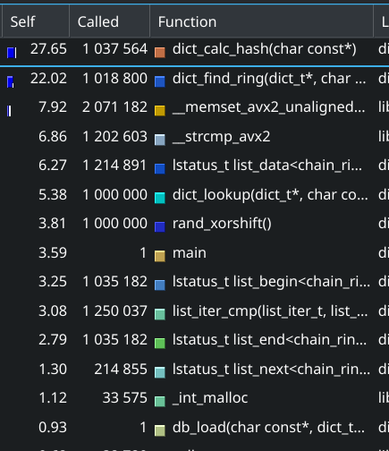
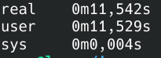
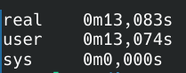

(WIP)

# Hash table optimization

## We have

We have a English-to-Russian dictionary based on a chaining hash table. Words definitions are loaded from file, you can write an English word and get a simple dictionary topic.
So, there are hash table with pointers to strings as keys and values, contents of the dictionary are loaded as a big buffer, then simple parser constructs in-place C strings and inserts pointers to the hash table. In a nutshell, a pretty efficient structure.

## Optimization strategy

First, we need to profile our application in order to spot functions which optimization will really speed up the application. I'm using Callgrind with Kcachegrind as a frontend. Second, we must profile and test the program in real-world use cases. In our case, it's important to speed up the search in the dictionary, since data loading and insertion into the dictionary occurs only once at the start of the program, while the search takes the rest of the program's operation time.

### Correct test

To make a test that respects the comments described, I took the dictionary client and replaced the user interaction loop with repeated dictionary searches. With this approach, things like file I/O and memory allocations have little effect on the profiling results, allowing us to see real bottlenecks.

## Profiling

At this point, we can start profiling. But which keys we should take for such repeated queries? To reproduce real life use case, I took all keys from the dictionary and use random key for each query. Profiling with two different rands (built-in and xor shift) shows that hashes calculation takes most of the time. The second place is taken by the dict_find_ring function.



## Optimizing 1

According to the profiling results, we should revise hash calculation algorithm at first. Now I'm using polynominal hash, but it isn't a good choice. I've found an elegant algorithm based on bit shifts. As we know, multiplication and, especially, division are much more heavier than bit shifts. So, let's try to replace the hash function and re-measure time.

 

Even slower! There are mismatch between our expectations and the result. Let's go deeper and take a look to the compilier output.

Polynominal hash:
```
00000000000006b0 <_Z14dict_calc_hashPKc>:
 6b0:   55                      push   rbp
 6b1:   48 89 e5                mov    rbp,rsp
 6b4:   48 89 7d f8             mov    QWORD PTR [rbp-0x8],rdi
 6b8:   48 c7 45 f0 00 00 00    mov    QWORD PTR [rbp-0x10],0x0
 6bf:   00 
 6c0:   48 8b 45 f8             mov    rax,QWORD PTR [rbp-0x8]
 6c4:   48 89 45 e8             mov    QWORD PTR [rbp-0x18],rax
 6c8:   48 8b 45 e8             mov    rax,QWORD PTR [rbp-0x18]
 6cc:   0f be 08                movsx  ecx,BYTE PTR [rax]
 6cf:   83 f9 00                cmp    ecx,0x0
 6d2:   0f 84 35 00 00 00       je     70d <_Z14dict_calc_hashPKc+0x5d>
 6d8:   48 69 45 f0 1f 00 00    imul   rax,QWORD PTR [rbp-0x10],0x1f
 6df:   00 
 6e0:   48 8b 4d e8             mov    rcx,QWORD PTR [rbp-0x18]
 6e4:   48 0f be 09             movsx  rcx,BYTE PTR [rcx]
 6e8:   48 01 c8                add    rax,rcx
 6eb:   31 d2                   xor    edx,edx
 6ed:   b9 07 ca 9a 3b          mov    ecx,0x3b9aca07
 6f2:   48 f7 f1                div    rcx
 6f5:   48 89 55 f0             mov    QWORD PTR [rbp-0x10],rdx
 6f9:   48 8b 4d e8             mov    rcx,QWORD PTR [rbp-0x18]
 6fd:   48 81 c1 01 00 00 00    add    rcx,0x1
 704:   48 89 4d e8             mov    QWORD PTR [rbp-0x18],rcx
 708:   e9 bb ff ff ff          jmp    6c8 <_Z14dict_calc_hashPKc+0x18>
 70d:   48 8b 45 f0             mov    rax,QWORD PTR [rbp-0x10]
 711:   5d                      pop    rbp
 712:   c3                      ret
 ```

Bit shift hash:
```
00000000000006b0 <_Z14dict_calc_hashPKc>:
 6b0:   55                      push   rbp
 6b1:   48 89 e5                mov    rbp,rsp
 6b4:   48 89 7d f8             mov    QWORD PTR [rbp-0x8],rdi
 6b8:   c7 45 f4 00 00 00 00    mov    DWORD PTR [rbp-0xc],0x0
 6bf:   48 8b 45 f8             mov    rax,QWORD PTR [rbp-0x8]
 6c3:   0f be 08                movsx  ecx,BYTE PTR [rax]
 6c6:   83 f9 00                cmp    ecx,0x0
 6c9:   0f 84 38 00 00 00       je     707 <_Z14dict_calc_hashPKc+0x57>
 6cf:   48 8b 45 f8             mov    rax,QWORD PTR [rbp-0x8]
 6d3:   0f be 08                movsx  ecx,BYTE PTR [rax]
 6d6:   03 4d f4                add    ecx,DWORD PTR [rbp-0xc]
 6d9:   89 4d f4                mov    DWORD PTR [rbp-0xc],ecx
 6dc:   8b 4d f4                mov    ecx,DWORD PTR [rbp-0xc]
 6df:   c1 e1 0a                shl    ecx,0xa
 6e2:   03 4d f4                add    ecx,DWORD PTR [rbp-0xc]
 6e5:   89 4d f4                mov    DWORD PTR [rbp-0xc],ecx
 6e8:   8b 4d f4                mov    ecx,DWORD PTR [rbp-0xc]
 6eb:   c1 e9 06                shr    ecx,0x6
 6ee:   33 4d f4                xor    ecx,DWORD PTR [rbp-0xc]
 6f1:   89 4d f4                mov    DWORD PTR [rbp-0xc],ecx
 6f4:   48 8b 45 f8             mov    rax,QWORD PTR [rbp-0x8]
 6f8:   48 05 01 00 00 00       add    rax,0x1
 6fe:   48 89 45 f8             mov    QWORD PTR [rbp-0x8],rax
 702:   e9 b8 ff ff ff          jmp    6bf <_Z14dict_calc_hashPKc+0xf>
 707:   8b 45 f4                mov    eax,DWORD PTR [rbp-0xc]
 70a:   c1 e0 03                shl    eax,0x3
 70d:   03 45 f4                add    eax,DWORD PTR [rbp-0xc]
 710:   89 45 f4                mov    DWORD PTR [rbp-0xc],eax
 713:   8b 45 f4                mov    eax,DWORD PTR [rbp-0xc]
 716:   c1 e8 0b                shr    eax,0xb
 719:   33 45 f4                xor    eax,DWORD PTR [rbp-0xc]
 71c:   89 45 f4                mov    DWORD PTR [rbp-0xc],eax
 71f:   8b 45 f4                mov    eax,DWORD PTR [rbp-0xc]
 722:   c1 e0 0f                shl    eax,0xf
 725:   03 45 f4                add    eax,DWORD PTR [rbp-0xc]
 728:   89 45 f4                mov    DWORD PTR [rbp-0xc],eax
 72b:   8b 45 f4                mov    eax,DWORD PTR [rbp-0xc]
 72e:   5d                      pop    rbp
 72f:   c3                      ret
```

As we see, compilier access memory very intensely - it seems to be a main problem. The bit shift version has more intensive memory usage than the polynomial version, so our expectations about divisions and bit shifts turned out to be insignificant against the frequent memory accesses. Let's use inline assembly to implement hashing logic and compare.

There are result:
```
00000000000006b0 <_Z14dict_calc_hashPKc>:
 6b0:   55                      push   %rbp
 6b1:   48 89 e5                mov    %rsp,%rbp
 6b4:   48 89 7d f8             mov    %rdi,-0x8(%rbp)
 6b8:   c7 45 f4 00 00 00 00    movl   $0x0,-0xc(%rbp)
 6bf:   48 8b 7d f8             mov    -0x8(%rbp),%rdi
 6c3:   31 c0                   xor    %eax,%eax
 6c5:   8a 0f                   mov    (%rdi),%cl
 6c7:   84 c9                   test   %cl,%cl
 6c9:   0f 84 20 00 00 00       je     6ef <end>

00000000000006cf <loop>:
 6cf:   0f b6 f1                movzbl %cl,%esi
 6d2:   01 f0                   add    %esi,%eax
 6d4:   89 c6                   mov    %eax,%esi
 6d6:   c1 e6 0a                shl    $0xa,%esi
 6d9:   01 f0                   add    %esi,%eax
 6db:   89 c6                   mov    %eax,%esi
 6dd:   c1 ee 06                shr    $0x6,%esi
 6e0:   31 f0                   xor    %esi,%eax
 6e2:   48 ff c7                inc    %rdi
 6e5:   8a 0f                   mov    (%rdi),%cl
 6e7:   84 c9                   test   %cl,%cl
 6e9:   0f 85 e0 ff ff ff       jne    6cf <loop>

00000000000006ef <end>:
 6ef:   89 c6                   mov    %eax,%esi
 6f1:   c1 e6 03                shl    $0x3,%esi
 6f4:   01 f0                   add    %esi,%eax
 6f6:   89 c6                   mov    %eax,%esi
 6f8:   c1 ee 0b                shr    $0xb,%esi
 6fb:   31 f0                   xor    %esi,%eax
 6fd:   89 c6                   mov    %eax,%esi
 6ff:   c1 e6 0f                shl    $0xf,%esi
 702:   01 f0                   add    %esi,%eax
 704:   89 45 f4                mov    %eax,-0xc(%rbp)
 707:   8b 45 f4                mov    -0xc(%rbp),%eax
 70a:   5d                      pop    %rbp
 70b:   c3                      retq   
 70c:   0f 1f 40 00             nopl   0x0(%rax)
```

Our version is much more lightweight - there are only one memory access per symbol. Let's compare. Comparing initial polynominal hashing and optimized bit shift hashing, we have achieved ~15% less time! Let's see profilier output now. Another heavily-used function is dict_find_ring. Let's see compilier output:
```
0000000000000500 <_Z14dict_find_ringP6dict_tPKcPP12chain_ring_t>:
 500:   55                      push   %rbp
 501:   48 89 e5                mov    %rsp,%rbp
 504:   48 81 ec 80 00 00 00    sub    $0x80,%rsp
 50b:   48 89 7d f0             mov    %rdi,-0x10(%rbp)
 50f:   48 89 75 e8             mov    %rsi,-0x18(%rbp)
 513:   48 89 55 e0             mov    %rdx,-0x20(%rbp)
 517:   c7 45 dc 00 00 00 00    movl   $0x0,-0x24(%rbp)
 51e:   48 8b 7d e8             mov    -0x18(%rbp),%rdi
 522:   e8 00 00 00 00          callq  527 <_Z14dict_find_ringP6dict_tPKcPP12chain_ring_t+0x27>
 527:   31 c9                   xor    %ecx,%ecx
 529:   48 8b 55 f0             mov    -0x10(%rbp),%rdx
 52d:   45 31 c0                xor    %r8d,%r8d
 530:   48 89 55 98             mov    %rdx,-0x68(%rbp)
 534:   44 89 c2                mov    %r8d,%edx
 537:   48 8b 75 98             mov    -0x68(%rbp),%rsi
 53b:   f7 76 10                divl   0x10(%rsi)
 53e:   89 55 d8                mov    %edx,-0x28(%rbp)
 541:   48 8b 7d f0             mov    -0x10(%rbp),%rdi
 545:   48 8b 7f 08             mov    0x8(%rdi),%rdi
 549:   8b 55 d8                mov    -0x28(%rbp),%edx
 54c:   41 89 d1                mov    %edx,%r9d
 54f:   4d 69 c9 30 00 00 00    imul   $0x30,%r9,%r9
 556:   4c 01 cf                add    %r9,%rdi
 559:   48 89 7d d0             mov    %rdi,-0x30(%rbp)
 55d:   48 8d 7d c8             lea    -0x38(%rbp),%rdi
 561:   49 89 f9                mov    %rdi,%r9
 564:   48 89 7d 90             mov    %rdi,-0x70(%rbp)
 568:   4c 89 cf                mov    %r9,%rdi
 56b:   89 ce                   mov    %ecx,%esi
 56d:   41 b9 04 00 00 00       mov    $0x4,%r9d
 573:   4c 89 ca                mov    %r9,%rdx
 576:   89 4d 8c                mov    %ecx,-0x74(%rbp)
 579:   4c 89 4d 80             mov    %r9,-0x80(%rbp)
 57d:   e8 00 00 00 00          callq  582 <_Z14dict_find_ringP6dict_tPKcPP12chain_ring_t+0x82>
 582:   48 8d 55 c0             lea    -0x40(%rbp),%rdx
 586:   48 89 d7                mov    %rdx,%rdi
 589:   8b 75 8c                mov    -0x74(%rbp),%esi
 58c:   48 8b 55 80             mov    -0x80(%rbp),%rdx
 590:   e8 00 00 00 00          callq  595 <_Z14dict_find_ringP6dict_tPKcPP12chain_ring_t+0x95>
 595:   48 8b 7d d0             mov    -0x30(%rbp),%rdi
 599:   48 8b 75 90             mov    -0x70(%rbp),%rsi
 59d:   e8 00 00 00 00          callq  5a2 <_Z14dict_find_ringP6dict_tPKcPP12chain_ring_t+0xa2>
 5a2:   89 45 dc                mov    %eax,-0x24(%rbp)
 5a5:   83 7d dc 00             cmpl   $0x0,-0x24(%rbp)
 5a9:   0f 84 0b 00 00 00       je     5ba <_Z14dict_find_ringP6dict_tPKcPP12chain_ring_t+0xba>
 5af:   8b 45 dc                mov    -0x24(%rbp),%eax
 5b2:   89 45 fc                mov    %eax,-0x4(%rbp)
 5b5:   e9 e7 00 00 00          jmpq   6a1 <_Z14dict_find_ringP6dict_tPKcPP12chain_ring_t+0x1a1>
 5ba:   48 8b 7d d0             mov    -0x30(%rbp),%rdi
 5be:   48 8d 75 c0             lea    -0x40(%rbp),%rsi
 5c2:   e8 00 00 00 00          callq  5c7 <_Z14dict_find_ringP6dict_tPKcPP12chain_ring_t+0xc7>
 5c7:   89 45 dc                mov    %eax,-0x24(%rbp)
 5ca:   83 7d dc 00             cmpl   $0x0,-0x24(%rbp)
 5ce:   0f 84 0b 00 00 00       je     5df <_Z14dict_find_ringP6dict_tPKcPP12chain_ring_t+0xdf>
 5d4:   8b 45 dc                mov    -0x24(%rbp),%eax
 5d7:   89 45 fc                mov    %eax,-0x4(%rbp)
 5da:   e9 c2 00 00 00          jmpq   6a1 <_Z14dict_find_ringP6dict_tPKcPP12chain_ring_t+0x1a1>
 5df:   e9 00 00 00 00          jmpq   5e4 <_Z14dict_find_ringP6dict_tPKcPP12chain_ring_t+0xe4>
 5e4:   8b 45 c8                mov    -0x38(%rbp),%eax
 5e7:   89 45 b8                mov    %eax,-0x48(%rbp)
 5ea:   8b 45 c0                mov    -0x40(%rbp),%eax
 5ed:   89 45 b0                mov    %eax,-0x50(%rbp)
 5f0:   8b 7d b8                mov    -0x48(%rbp),%edi
 5f3:   8b 75 b0                mov    -0x50(%rbp),%esi
 5f6:   e8 00 00 00 00          callq  5fb <_Z14dict_find_ringP6dict_tPKcPP12chain_ring_t+0xfb>
 5fb:   34 ff                   xor    $0xff,%al
 5fd:   a8 01                   test   $0x1,%al
 5ff:   0f 85 05 00 00 00       jne    60a <_Z14dict_find_ringP6dict_tPKcPP12chain_ring_t+0x10a>
 605:   e9 90 00 00 00          jmpq   69a <_Z14dict_find_ringP6dict_tPKcPP12chain_ring_t+0x19a>
 60a:   48 c7 45 a8 00 00 00    movq   $0x0,-0x58(%rbp)
 611:   00 
 612:   48 8b 7d d0             mov    -0x30(%rbp),%rdi
 616:   8b 45 c8                mov    -0x38(%rbp),%eax
 619:   89 45 a0                mov    %eax,-0x60(%rbp)
 61c:   8b 75 a0                mov    -0x60(%rbp),%esi
 61f:   48 8d 55 a8             lea    -0x58(%rbp),%rdx
 623:   e8 00 00 00 00          callq  628 <_Z14dict_find_ringP6dict_tPKcPP12chain_ring_t+0x128>
 628:   89 45 dc                mov    %eax,-0x24(%rbp)
 62b:   83 7d dc 00             cmpl   $0x0,-0x24(%rbp)
 62f:   0f 84 0b 00 00 00       je     640 <_Z14dict_find_ringP6dict_tPKcPP12chain_ring_t+0x140>
 635:   8b 45 dc                mov    -0x24(%rbp),%eax
 638:   89 45 fc                mov    %eax,-0x4(%rbp)
 63b:   e9 61 00 00 00          jmpq   6a1 <_Z14dict_find_ringP6dict_tPKcPP12chain_ring_t+0x1a1>
 640:   48 8b 45 a8             mov    -0x58(%rbp),%rax
 644:   48 8b 38                mov    (%rax),%rdi
 647:   48 8b 75 e8             mov    -0x18(%rbp),%rsi
 64b:   e8 00 00 00 00          callq  650 <_Z14dict_find_ringP6dict_tPKcPP12chain_ring_t+0x150>
 650:   83 f8 00                cmp    $0x0,%eax
 653:   0f 85 17 00 00 00       jne    670 <_Z14dict_find_ringP6dict_tPKcPP12chain_ring_t+0x170>
 659:   48 8b 45 a8             mov    -0x58(%rbp),%rax
 65d:   48 8b 4d e0             mov    -0x20(%rbp),%rcx
 661:   48 89 01                mov    %rax,(%rcx)
 664:   c7 45 fc 00 00 00 00    movl   $0x0,-0x4(%rbp)
 66b:   e9 31 00 00 00          jmpq   6a1 <_Z14dict_find_ringP6dict_tPKcPP12chain_ring_t+0x1a1>
 670:   48 8b 7d d0             mov    -0x30(%rbp),%rdi
 674:   48 8d 75 c8             lea    -0x38(%rbp),%rsi
 678:   e8 00 00 00 00          callq  67d <_Z14dict_find_ringP6dict_tPKcPP12chain_ring_t+0x17d>
 67d:   89 45 dc                mov    %eax,-0x24(%rbp)
 680:   83 7d dc 00             cmpl   $0x0,-0x24(%rbp)
 684:   0f 84 0b 00 00 00       je     695 <_Z14dict_find_ringP6dict_tPKcPP12chain_ring_t+0x195>
 68a:   8b 45 dc                mov    -0x24(%rbp),%eax
 68d:   89 45 fc                mov    %eax,-0x4(%rbp)
 690:   e9 0c 00 00 00          jmpq   6a1 <_Z14dict_find_ringP6dict_tPKcPP12chain_ring_t+0x1a1>
 695:   e9 4a ff ff ff          jmpq   5e4 <_Z14dict_find_ringP6dict_tPKcPP12chain_ring_t+0xe4>
 69a:   c7 45 fc 08 00 00 00    movl   $0x8,-0x4(%rbp)
 6a1:   8b 45 fc                mov    -0x4(%rbp),%eax
 6a4:   48 81 c4 80 00 00 00    add    $0x80,%rsp
 6ab:   5d                      pop    %rbp
 6ac:   c3                      retq   
 6ad:   0f 1f 00                nopl   (%rax)
```

We see intensive memory accesses again. Let's rewrite manually:
```
0000000000000000 <_Z14dict_find_ringP6dict_tPKcPP12chain_ring_t>:
   0:   41 54                   push   %r12
   2:   41 55                   push   %r13
   4:   41 56                   push   %r14
   6:   41 57                   push   %r15
   8:   48 83 ec 18             sub    $0x18,%rsp
   c:   49 89 fc                mov    %rdi,%r12
   f:   49 89 f5                mov    %rsi,%r13
  12:   49 89 d6                mov    %rdx,%r14
  15:   4c 89 ef                mov    %r13,%rdi
  18:   e8 00 00 00 00          callq  1d <_Z14dict_find_ringP6dict_tPKcPP12chain_ring_t+0x1d>
  1d:   41 8b 4c 24 10          mov    0x10(%r12),%ecx
  22:   31 d2                   xor    %edx,%edx
  24:   f7 f9                   idiv   %ecx
  26:   41 89 d7                mov    %edx,%r15d
  29:   49 8b 44 24 08          mov    0x8(%r12),%rax
  2e:   44 89 f9                mov    %r15d,%ecx
  31:   48 c1 e1 04             shl    $0x4,%rcx
  35:   48 8d 0c 49             lea    (%rcx,%rcx,2),%rcx
  39:   48 8d 04 08             lea    (%rax,%rcx,1),%rax
  3d:   49 89 c7                mov    %rax,%r15
  40:   c7 04 24 00 00 00 00    movl   $0x0,(%rsp)
  47:   c7 44 24 04 00 00 00    movl   $0x0,0x4(%rsp)
  4e:   00 
  4f:   4c 89 ff                mov    %r15,%rdi
  52:   48 8d 34 24             lea    (%rsp),%rsi
  56:   e8 00 00 00 00          callq  5b <_Z14dict_find_ringP6dict_tPKcPP12chain_ring_t+0x5b>
  5b:   85 c0                   test   %eax,%eax
  5d:   75 7b                   jne    da <end>
  5f:   4c 89 ff                mov    %r15,%rdi
  62:   48 8d 74 24 04          lea    0x4(%rsp),%rsi
  67:   e8 00 00 00 00          callq  6c <_Z14dict_find_ringP6dict_tPKcPP12chain_ring_t+0x6c>
  6c:   85 c0                   test   %eax,%eax
  6e:   75 6a                   jne    da <end>
  70:   8b 34 24                mov    (%rsp),%esi
  73:   8b 7c 24 04             mov    0x4(%rsp),%edi
  77:   e8 00 00 00 00          callq  7c <_Z14dict_find_ringP6dict_tPKcPP12chain_ring_t+0x7c>
  7c:   85 c0                   test   %eax,%eax
  7e:   75 55                   jne    d5 <while_end>

0000000000000080 <while>:
  80:   4c 89 ff                mov    %r15,%rdi
  83:   48 8b 34 24             mov    (%rsp),%rsi
  87:   48 8d 54 24 08          lea    0x8(%rsp),%rdx
  8c:   e8 00 00 00 00          callq  91 <while+0x11>
  91:   85 c0                   test   %eax,%eax
  93:   75 45                   jne    da <end>
  95:   48 8b 7c 24 08          mov    0x8(%rsp),%rdi
  9a:   48 8b 3f                mov    (%rdi),%rdi
  9d:   4c 89 ee                mov    %r13,%rsi
  a0:   e8 00 00 00 00          callq  a5 <while+0x25>
  a5:   48 85 c0                test   %rax,%rax
  a8:   75 0c                   jne    b6 <if_skip>
  aa:   48 8b 7c 24 08          mov    0x8(%rsp),%rdi
  af:   49 89 3e                mov    %rdi,(%r14)
  b2:   31 c0                   xor    %eax,%eax
  b4:   eb 24                   jmp    da <end>

00000000000000b6 <if_skip>:
  b6:   4c 89 ff                mov    %r15,%rdi
  b9:   48 89 e6                mov    %rsp,%rsi
  bc:   e8 00 00 00 00          callq  c1 <if_skip+0xb>
  c1:   85 c0                   test   %eax,%eax
  c3:   75 15                   jne    da <end>
  c5:   8b 34 24                mov    (%rsp),%esi
  c8:   8b 7c 24 04             mov    0x4(%rsp),%edi
  cc:   e8 00 00 00 00          callq  d1 <if_skip+0x1b>
  d1:   85 c0                   test   %eax,%eax
  d3:   74 ab                   je     80 <while>

00000000000000d5 <while_end>:
  d5:   b8 08 00 00 00          mov    $0x8,%eax

00000000000000da <end>:
  da:   48 83 c4 18             add    $0x18,%rsp
  de:   41 5f                   pop    %r15
  e0:   41 5e                   pop    %r14
  e2:   41 5d                   pop    %r13
  e4:   41 5c                   pop    %r12
  e6:   c3                      retq
```
We managed to reduce some memory accesses. Comparing with previous result, 
