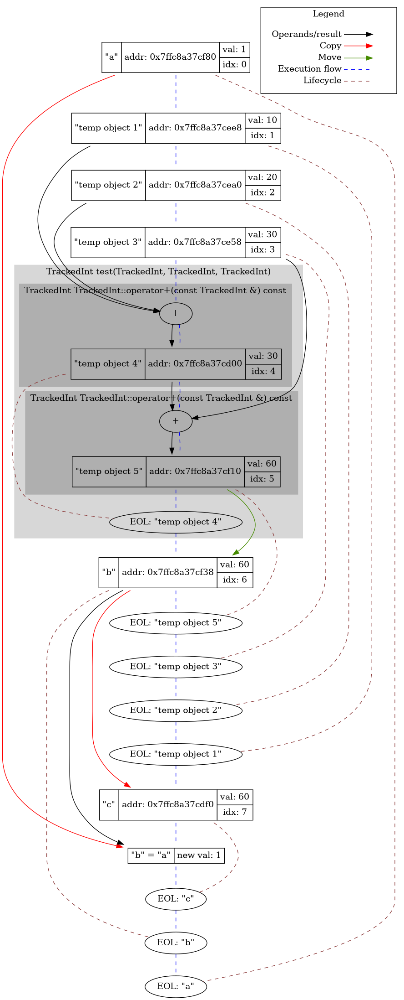

# TrackedInt

There is a tool that hooks operations with instances of a certain class that behaves like an integer. The result is a text and graphic log that represents the full lifecycle of objects - creation, copying, moving and destruction. To demonstrate the power of the tool, small analysis about temporary objects and move semantics is present.

## Tool overview

Let's run the tool on the simple program:

```c++
TrackedInt test(TrackedInt a, TrackedInt b, TrackedInt c)
{
    FUNC_ENTRY;
    return a + b + c;
}

void testEntry()
{
    INT(a, 1);
    INT(b, test(TrackedInt(10), TrackedInt(20), TrackedInt(30)));
    INT(c, a);
}
```

There are several additional macros INT and FUNC_ENTRY to inform the tool about the names of the objects being created and the function calls, respectively. Let's take a look to the tool's output:

<pre>
[New] "a" (0|0x7ffe3fc05590) <-- 1
[New] "temp object 1" (1|0x7ffe3fc054f8) <-- 10
[New] "temp object 2" (2|0x7ffe3fc054b0) <-- 20
[New] "temp object 3" (3|0x7ffe3fc05468) <-- 30
TrackedInt test(TrackedInt, TrackedInt, TrackedInt)
{
    TrackedInt TrackedInt::operator+(const TrackedInt &) const
    {
        [New] "temp object 4" (4|0x7ffe3fc05310) <--(30)-- "temp object 1" (1|0x7ffe3fc054f8) + "temp object 2" (2|0x7ffe3fc054b0)
    }
    TrackedInt TrackedInt::operator+(const TrackedInt &) const
    {
        [New] "temp object 5" (5|0x7ffe3fc05520) <--(60)-- "temp object 4" (4|0x7ffe3fc05310) + "temp object 3" (3|0x7ffe3fc05468)
    }
    [EOL] "temp object 4" (4|0x7ffe3fc05310)
}
[<font color=#00FF00>Move</font>] "b" (6|0x7ffe3fc05548) <--(60)-- "temp object 5" (5|0x7ffe3fc05520)
[EOL] "temp object 5" (5|0x7ffe3fc05520)
[EOL] "temp object 3" (3|0x7ffe3fc05468)
[EOL] "temp object 2" (2|0x7ffe3fc054b0)
[EOL] "temp object 1" (1|0x7ffe3fc054f8)
[<font color=#FF0000>COPY</font>] "c" (7|0x7ffe3fc05400) <--(1)-- "a" (0|0x7ffe3fc05590)
[EOL] "c" (7|0x7ffe3fc05400)
[EOL] "b" (6|0x7ffe3fc05548)
[EOL] "a" (0|0x7ffe3fc05590)
Total: 5 tmp object, 1 copies
</pre>

It's quite straighforward. `[New]` means that a new object is created and initialized with some value (may be result of some operator), `[Copy]` and `[Move]` represents copy and move constructors correspondingly. Similarly, `[Copy=]` and `[Move=]` represents copy and move assignments. And finally, `[EOL]` means that destructor of the object is called. 

The tool tries to show variable names that it knows about. However, each object has a unique number that allows to distinguish between temporary objects, as well as objects with the same name due to nested function calls. The unique number is displayed along with the name of the object and its address.

Also let's take a look to the graphical variant:

Rectangle node represents object, circle node is the operator and ellipse nodes represent the end of object's life. Nodes are ordered by program's execution flow. Copying, moving and objects relationship are represented with different edges.

Let's understand what is going on in the test program. First, the "a" variable is created. Then, temporary objects corresponding to the function call arguments are created to be passed to the function. In the function, the passed objects are used to evaluate the expression, during which a temporary object 4 is created and destroyed after evaluation. After that, the result is returned to the caller and all temporary objects are destroyed. At the end, "c" is created as the copy of "a".

## Analysis

After we have learned how to work with the tool, I propose to analyze the lifetime of temporary objects and how move semantics allow us to write more efficient code.

Let's take a look to this sample program:

```c++
TrackedInt test(TrackedInt a, TrackedInt b, TrackedInt c)
{
    FUNC_ENTRY;
    return a + b + c;
}

void testEntry()
{
    FUNC_ENTRY;

    INT(res1, test(TrackedInt(10), TrackedInt(20), TrackedInt(30)));

    INT(a, 0);
    INT(b, 0);
    INT(c, 0);

    a = 1;
    b = 2;
    c = 3;

    INT(res2, test(a, b, c));

    INT(res3, 0);
    res3 = (a - b) * c;
}
```

<pre>
void testEntry()
{
    [New] "temp object 0" (0|0x7ffd59cf6ae0) <-- 10
    [New] "temp object 1" (1|0x7ffd59cf6a98) <-- 20
    [New] "temp object 2" (2|0x7ffd59cf6a50) <-- 30
    TrackedInt test(TrackedInt, TrackedInt, TrackedInt)
    {
        TrackedInt TrackedInt::operator+(const TrackedInt &) const
        {
            [New] "temp object 3" (3|0x7ffd59cf6500) <--(30)-- "temp object 0" (0|0x7ffd59cf6ae0) + "temp object 1" (1|0x7ffd59cf6a98)
        }
        TrackedInt TrackedInt::operator+(const TrackedInt &) const
        {
            [New] "temp object 4" (4|0x7ffd59cf6b08) <--(60)-- "temp object 3" (3|0x7ffd59cf6500) + "temp object 2" (2|0x7ffd59cf6a50)
        }
        [EOL] "temp object 3" (3|0x7ffd59cf6500)
    }
    [<font color=#FF0000>COPY</font>] "res1" (5|0x7ffd59cf6b30) <--(60)-- "temp object 4" (4|0x7ffd59cf6b08)
    [EOL] "temp object 4" (4|0x7ffd59cf6b08)
    [EOL] "temp object 2" (2|0x7ffd59cf6a50)
    [EOL] "temp object 1" (1|0x7ffd59cf6a98)
    [EOL] "temp object 0" (0|0x7ffd59cf6ae0)
    [New] "a" (6|0x7ffd59cf69e8) <-- 0
    [New] "b" (7|0x7ffd59cf69a0) <-- 0
    [New] "c" (8|0x7ffd59cf6958) <-- 0
    [New] "temp object 9" (9|0x7ffd59cf6910) <-- 1
    [<font color=#FF0000>Copy=</font>] "a" (6|0x7ffd59cf69e8) <--(1)-- "temp object 9" (9|0x7ffd59cf6910)
    [EOL] "temp object 9" (9|0x7ffd59cf6910)
    [New] "temp object 10" (10|0x7ffd59cf68c8) <-- 2
    [<font color=#FF0000>Copy=</font>] "b" (7|0x7ffd59cf69a0) <--(2)-- "temp object 10" (10|0x7ffd59cf68c8)
    [EOL] "temp object 10" (10|0x7ffd59cf68c8)
    [New] "temp object 11" (11|0x7ffd59cf6880) <-- 3
    [<font color=#FF0000>Copy=</font>] "c" (8|0x7ffd59cf6958) <--(3)-- "temp object 11" (11|0x7ffd59cf6880)
    [EOL] "temp object 11" (11|0x7ffd59cf6880)
    [<font color=#FF0000>COPY</font>] "temp object 12" (12|0x7ffd59cf67e8) <--(1)-- "a" (6|0x7ffd59cf69e8)
    [<font color=#FF0000>COPY</font>] "temp object 13" (13|0x7ffd59cf67a0) <--(2)-- "b" (7|0x7ffd59cf69a0)
    [<font color=#FF0000>COPY</font>] "temp object 14" (14|0x7ffd59cf6758) <--(3)-- "c" (8|0x7ffd59cf6958)
    TrackedInt test(TrackedInt, TrackedInt, TrackedInt)
    {
        TrackedInt TrackedInt::operator+(const TrackedInt &) const
        {
            [New] "temp object 15" (15|0x7ffd59cf6500) <--(3)-- "temp object 12" (12|0x7ffd59cf67e8) + "temp object 13" (13|0x7ffd59cf67a0)
        }
        TrackedInt TrackedInt::operator+(const TrackedInt &) const
        {
            [New] "temp object 16" (16|0x7ffd59cf6810) <--(6)-- "temp object 15" (15|0x7ffd59cf6500) + "temp object 14" (14|0x7ffd59cf6758)
        }
        [EOL] "temp object 15" (15|0x7ffd59cf6500)
    }
    [<font color=#FF0000>COPY</font>] "res2" (17|0x7ffd59cf6838) <--(6)-- "temp object 16" (16|0x7ffd59cf6810)
    [EOL] "temp object 16" (16|0x7ffd59cf6810)
    [EOL] "temp object 14" (14|0x7ffd59cf6758)
    [EOL] "temp object 13" (13|0x7ffd59cf67a0)
    [EOL] "temp object 12" (12|0x7ffd59cf67e8)
    [New] "res3" (18|0x7ffd59cf66f0) <-- 0
    TrackedInt TrackedInt::operator-(const TrackedInt &) const
    {
        [New] "temp object 19" (19|0x7ffd59cf6680) <--(-1)-- "a" (6|0x7ffd59cf69e8) - "b" (7|0x7ffd59cf69a0)
    }
    TrackedInt TrackedInt::operator*(const TrackedInt &) const
    {
        [New] "temp object 20" (20|0x7ffd59cf66a8) <--(-3)-- "temp object 19" (19|0x7ffd59cf6680) * "c" (8|0x7ffd59cf6958)
    }
    [<font color=#FF0000>Copy=</font>] "res3" (18|0x7ffd59cf66f0) <--(-3)-- "temp object 20" (20|0x7ffd59cf66a8)
    [EOL] "temp object 20" (20|0x7ffd59cf66a8)
    [EOL] "temp object 19" (19|0x7ffd59cf6680)
    [EOL] "res3" (18|0x7ffd59cf66f0)
    [EOL] "res2" (17|0x7ffd59cf6838)
    [EOL] "c" (8|0x7ffd59cf6958)
    [EOL] "b" (7|0x7ffd59cf69a0)
    [EOL] "a" (6|0x7ffd59cf69e8)
    [EOL] "res1" (5|0x7ffd59cf6b30)
}
Total: 15 tmp object, 9 copies
</pre>

Let's return to our program. We can see that temporary objects are destructed shortly after copying. It is not a problem in our case because copying of TrackedInt is cheap, but copying of objects like std::string can be expensive. In our program there are unnecessary copying during expressions like `a = 1` or `res3 = (a - b) * c` - 
in the last example temporary object corresponding to evaluated `(a - b) * c` value is copied into `res3` and destructed immediately after this. In fact, the situation can be even worse - the compiler optimizes many temporary objects as part of optimizations which called "copy elision". Let's ask the compiler to disable these optimizations and look to the tool's output:
<pre>
void testEntry()
{
    [New] "temp object 0" (0|0x7ffc7f1cfbc8) <-- 10
    [<font color=#FF0000>COPY</font>] "temp object 1" (1|0x7ffc7f1cfbf0) <--(10)-- "temp object 0" (0|0x7ffc7f1cfbc8)
    [New] "temp object 2" (2|0x7ffc7f1cfb38) <-- 20
    [<font color=#FF0000>COPY</font>] "temp object 3" (3|0x7ffc7f1cfb60) <--(20)-- "temp object 2" (2|0x7ffc7f1cfb38)
    [New] "temp object 4" (4|0x7ffc7f1cfaa8) <-- 30
    [<font color=#FF0000>COPY</font>] "temp object 5" (5|0x7ffc7f1cfad0) <--(30)-- "temp object 4" (4|0x7ffc7f1cfaa8)
    TrackedInt test(TrackedInt, TrackedInt, TrackedInt)
    {
        TrackedInt TrackedInt::operator+(const TrackedInt &) const
        {
            [New] "temp object 6" (6|0x7ffc7f1cf400) <--(30)-- "temp object 1" (1|0x7ffc7f1cfbf0) + "temp object 3" (3|0x7ffc7f1cfb60)
            [<font color=#FF0000>COPY</font>] "temp object 7" (7|0x7ffc7f1cf4e8) <--(30)-- "temp object 6" (6|0x7ffc7f1cf400)
            [EOL] "temp object 6" (6|0x7ffc7f1cf400)
        }
        TrackedInt TrackedInt::operator+(const TrackedInt &) const
        {
            [New] "temp object 8" (8|0x7ffc7f1cf400) <--(60)-- "temp object 7" (7|0x7ffc7f1cf4e8) + "temp object 5" (5|0x7ffc7f1cfad0)
            [<font color=#FF0000>COPY</font>] "temp object 9" (9|0x7ffc7f1cf510) <--(60)-- "temp object 8" (8|0x7ffc7f1cf400)
            [EOL] "temp object 8" (8|0x7ffc7f1cf400)
        }
        [<font color=#FF0000>COPY</font>] "temp object 10" (10|0x7ffc7f1cfc18) <--(60)-- "temp object 9" (9|0x7ffc7f1cf510)
        [EOL] "temp object 9" (9|0x7ffc7f1cf510)
        [EOL] "temp object 7" (7|0x7ffc7f1cf4e8)
    }
    [<font color=#FF0000>COPY</font>] "res1" (11|0x7ffc7f1cfc40) <--(60)-- "temp object 10" (10|0x7ffc7f1cfc18)
    [EOL] "temp object 10" (10|0x7ffc7f1cfc18)
    [EOL] "temp object 5" (5|0x7ffc7f1cfad0)
    [EOL] "temp object 4" (4|0x7ffc7f1cfaa8)
    [EOL] "temp object 3" (3|0x7ffc7f1cfb60)
    [EOL] "temp object 2" (2|0x7ffc7f1cfb38)
    [EOL] "temp object 1" (1|0x7ffc7f1cfbf0)
    [EOL] "temp object 0" (0|0x7ffc7f1cfbc8)
    [New] "a" (12|0x7ffc7f1cfa20) <-- 0
    [New] "b" (13|0x7ffc7f1cf9d8) <-- 0
    [New] "c" (14|0x7ffc7f1cf990) <-- 0
    [New] "temp object 15" (15|0x7ffc7f1cf948) <-- 1
    [<font color=#FF0000>Copy=</font>] "a" (12|0x7ffc7f1cfa20) <--(1)-- "temp object 15" (15|0x7ffc7f1cf948)
    [EOL] "temp object 15" (15|0x7ffc7f1cf948)
    [New] "temp object 16" (16|0x7ffc7f1cf900) <-- 2
    [<font color=#FF0000>Copy=</font>] "b" (13|0x7ffc7f1cf9d8) <--(2)-- "temp object 16" (16|0x7ffc7f1cf900)
    [EOL] "temp object 16" (16|0x7ffc7f1cf900)
    [New] "temp object 17" (17|0x7ffc7f1cf8b8) <-- 3
    [<font color=#FF0000>Copy=</font>] "c" (14|0x7ffc7f1cf990) <--(3)-- "temp object 17" (17|0x7ffc7f1cf8b8)
    [EOL] "temp object 17" (17|0x7ffc7f1cf8b8)
    [<font color=#FF0000>COPY</font>] "temp object 18" (18|0x7ffc7f1cf820) <--(1)-- "a" (12|0x7ffc7f1cfa20)
    [<font color=#FF0000>COPY</font>] "temp object 19" (19|0x7ffc7f1cf7d8) <--(2)-- "b" (13|0x7ffc7f1cf9d8)
    [<font color=#FF0000>COPY</font>] "temp object 20" (20|0x7ffc7f1cf790) <--(3)-- "c" (14|0x7ffc7f1cf990)
    TrackedInt test(TrackedInt, TrackedInt, TrackedInt)
    {
        TrackedInt TrackedInt::operator+(const TrackedInt &) const
        {
            [New] "temp object 21" (21|0x7ffc7f1cf400) <--(3)-- "temp object 18" (18|0x7ffc7f1cf820) + "temp object 19" (19|0x7ffc7f1cf7d8)
            [<font color=#FF0000>COPY</font>] "temp object 22" (22|0x7ffc7f1cf4e8) <--(3)-- "temp object 21" (21|0x7ffc7f1cf400)
            [EOL] "temp object 21" (21|0x7ffc7f1cf400)
        }
        TrackedInt TrackedInt::operator+(const TrackedInt &) const
        {
            [New] "temp object 23" (23|0x7ffc7f1cf400) <--(6)-- "temp object 22" (22|0x7ffc7f1cf4e8) + "temp object 20" (20|0x7ffc7f1cf790)
            [<font color=#FF0000>COPY</font>] "temp object 24" (24|0x7ffc7f1cf510) <--(6)-- "temp object 23" (23|0x7ffc7f1cf400)
            [EOL] "temp object 23" (23|0x7ffc7f1cf400)
        }
        [<font color=#FF0000>COPY</font>] "temp object 25" (25|0x7ffc7f1cf848) <--(6)-- "temp object 24" (24|0x7ffc7f1cf510)
        [EOL] "temp object 24" (24|0x7ffc7f1cf510)
        [EOL] "temp object 22" (22|0x7ffc7f1cf4e8)
    }
    [<font color=#FF0000>COPY</font>] "res2" (26|0x7ffc7f1cf870) <--(6)-- "temp object 25" (25|0x7ffc7f1cf848)
    [EOL] "temp object 25" (25|0x7ffc7f1cf848)
    [EOL] "temp object 20" (20|0x7ffc7f1cf790)
    [EOL] "temp object 19" (19|0x7ffc7f1cf7d8)
    [EOL] "temp object 18" (18|0x7ffc7f1cf820)
    [New] "res3" (27|0x7ffc7f1cf728) <-- 0
    TrackedInt TrackedInt::operator-(const TrackedInt &) const
    {
        [New] "temp object 28" (28|0x7ffc7f1cf510) <--(-1)-- "a" (12|0x7ffc7f1cfa20) - "b" (13|0x7ffc7f1cf9d8)
        [<font color=#FF0000>COPY</font>] "temp object 29" (29|0x7ffc7f1cf6b8) <--(-1)-- "temp object 28" (28|0x7ffc7f1cf510)
        [EOL] "temp object 28" (28|0x7ffc7f1cf510)
    }
    TrackedInt TrackedInt::operator*(const TrackedInt &) const
    {
        [New] "temp object 30" (30|0x7ffc7f1cf510) <--(-3)-- "temp object 29" (29|0x7ffc7f1cf6b8) * "c" (14|0x7ffc7f1cf990)
        [<font color=#FF0000>COPY</font>] "temp object 31" (31|0x7ffc7f1cf6e0) <--(-3)-- "temp object 30" (30|0x7ffc7f1cf510)
        [EOL] "temp object 30" (30|0x7ffc7f1cf510)
    }
    [<font color=#FF0000>Copy=</font>] "res3" (27|0x7ffc7f1cf728) <--(-3)-- "temp object 31" (31|0x7ffc7f1cf6e0)
    [EOL] "temp object 31" (31|0x7ffc7f1cf6e0)
    [EOL] "temp object 29" (29|0x7ffc7f1cf6b8)
    [EOL] "res3" (27|0x7ffc7f1cf728)
    [EOL] "res2" (26|0x7ffc7f1cf870)
    [EOL] "c" (14|0x7ffc7f1cf990)
    [EOL] "b" (13|0x7ffc7f1cf9d8)
    [EOL] "a" (12|0x7ffc7f1cfa20)
    [EOL] "res1" (11|0x7ffc7f1cfc40)
}
Total: 26 tmp object, 20 copies
</pre>

Some additional temporary objects are created of lack of Return Value Optimization - compiler creates additional object during statements like `return TrackedInt(..)`. Also, passing temporary object to the function by value isn't optimized - there are additional unnecessary copy of temporary object.

Now let's look to the tool's output when TrackedInt have move constructor and move assignment operator:
<pre>
void testEntry()
{
    [New] "temp object 0" (0|0x7fff2ab28390) <-- 10
    [New] "temp object 1" (1|0x7fff2ab28348) <-- 20
    [New] "temp object 2" (2|0x7fff2ab28300) <-- 30
    TrackedInt test(TrackedInt, TrackedInt, TrackedInt)
    {
        TrackedInt TrackedInt::operator+(const TrackedInt &) const
        {
            [New] "temp object 3" (3|0x7fff2ab27db0) <--(30)-- "temp object 0" (0|0x7fff2ab28390) + "temp object 1" (1|0x7fff2ab28348)
        }
        TrackedInt TrackedInt::operator+(const TrackedInt &) const
        {
            [New] "temp object 4" (4|0x7fff2ab283b8) <--(60)-- "temp object 3" (3|0x7fff2ab27db0) + "temp object 2" (2|0x7fff2ab28300)
        }
        [EOL] "temp object 3" (3|0x7fff2ab27db0)
    }
    [<font color=#00FF00>Move</font>] "res1" (5|0x7fff2ab283e0) <--(60)-- "temp object 4" (4|0x7fff2ab283b8)
    [EOL] "temp object 4" (4|0x7fff2ab283b8)
    [EOL] "temp object 2" (2|0x7fff2ab28300)
    [EOL] "temp object 1" (1|0x7fff2ab28348)
    [EOL] "temp object 0" (0|0x7fff2ab28390)
    [New] "a" (6|0x7fff2ab28298) <-- 0
    [New] "b" (7|0x7fff2ab28250) <-- 0
    [New] "c" (8|0x7fff2ab28208) <-- 0
    [New] "temp object 9" (9|0x7fff2ab281c0) <-- 1
    [<font color=#00FF00>Move=</font>] "a" (6|0x7fff2ab28298) <--(1)-- "temp object 9" (9|0x7fff2ab281c0)
    [EOL] "temp object 9" (9|0x7fff2ab281c0)
    [New] "temp object 10" (10|0x7fff2ab28178) <-- 2
    [<font color=#00FF00>Move=</font>] "b" (7|0x7fff2ab28250) <--(2)-- "temp object 10" (10|0x7fff2ab28178)
    [EOL] "temp object 10" (10|0x7fff2ab28178)
    [New] "temp object 11" (11|0x7fff2ab28130) <-- 3
    [<font color=#00FF00>Move=</font>] "c" (8|0x7fff2ab28208) <--(3)-- "temp object 11" (11|0x7fff2ab28130)
    [EOL] "temp object 11" (11|0x7fff2ab28130)
    [<font color=#FF0000>COPY</font>] "temp object 12" (12|0x7fff2ab28098) <--(1)-- "a" (6|0x7fff2ab28298)
    [<font color=#FF0000>COPY</font>] "temp object 13" (13|0x7fff2ab28050) <--(2)-- "b" (7|0x7fff2ab28250)
    [<font color=#FF0000>COPY</font>] "temp object 14" (14|0x7fff2ab28008) <--(3)-- "c" (8|0x7fff2ab28208)
    TrackedInt test(TrackedInt, TrackedInt, TrackedInt)
    {
        TrackedInt TrackedInt::operator+(const TrackedInt &) const
        {
            [New] "temp object 15" (15|0x7fff2ab27db0) <--(3)-- "temp object 12" (12|0x7fff2ab28098) + "temp object 13" (13|0x7fff2ab28050)
        }
        TrackedInt TrackedInt::operator+(const TrackedInt &) const
        {
            [New] "temp object 16" (16|0x7fff2ab280c0) <--(6)-- "temp object 15" (15|0x7fff2ab27db0) + "temp object 14" (14|0x7fff2ab28008)
        }
        [EOL] "temp object 15" (15|0x7fff2ab27db0)
    }
    [<font color=#00FF00>Move</font>] "res2" (17|0x7fff2ab280e8) <--(6)-- "temp object 16" (16|0x7fff2ab280c0)
    [EOL] "temp object 16" (16|0x7fff2ab280c0)
    [EOL] "temp object 14" (14|0x7fff2ab28008)
    [EOL] "temp object 13" (13|0x7fff2ab28050)
    [EOL] "temp object 12" (12|0x7fff2ab28098)
    [New] "res3" (18|0x7fff2ab27fa0) <-- 0
    TrackedInt TrackedInt::operator-(const TrackedInt &) const
    {
        [New] "temp object 19" (19|0x7fff2ab27f30) <--(-1)-- "a" (6|0x7fff2ab28298) - "b" (7|0x7fff2ab28250)
    }
    TrackedInt TrackedInt::operator*(const TrackedInt &) const
    {
        [New] "temp object 20" (20|0x7fff2ab27f58) <--(-3)-- "temp object 19" (19|0x7fff2ab27f30) * "c" (8|0x7fff2ab28208)
    }
    [<font color=#00FF00>Move=</font>] "res3" (18|0x7fff2ab27fa0) <--(-3)-- "temp object 20" (20|0x7fff2ab27f58)
    [EOL] "temp object 20" (20|0x7fff2ab27f58)
    [EOL] "temp object 19" (19|0x7fff2ab27f30)
    [EOL] "res3" (18|0x7fff2ab27fa0)
    [EOL] "res2" (17|0x7fff2ab280e8)
    [EOL] "c" (8|0x7fff2ab28208)
    [EOL] "b" (7|0x7fff2ab28250)
    [EOL] "a" (6|0x7fff2ab28298)
    [EOL] "res1" (5|0x7fff2ab283e0)
}
Total: 15 tmp object, 3 copies
</pre>

All unnecessary copies are gone! Due to move semantics, we can be noticed that object which passed to the constructor/assignment will be dead shortly and it can be moved entirely instead of copying.

The result is even more impressive when copy elision is disabled:
<pre>
void testEntry()
{
    [New] "temp object 0" (0|0x7ffdf5d15b68) <-- 10
    [<font color=#00FF00>Move</font>] "temp object 1" (1|0x7ffdf5d15b90) <--(10)-- "temp object 0" (0|0x7ffdf5d15b68)
    [New] "temp object 2" (2|0x7ffdf5d15ad8) <-- 20
    [<font color=#00FF00>Move</font>] "temp object 3" (3|0x7ffdf5d15b00) <--(20)-- "temp object 2" (2|0x7ffdf5d15ad8)
    [New] "temp object 4" (4|0x7ffdf5d15a48) <-- 30
    [<font color=#00FF00>Move</font>] "temp object 5" (5|0x7ffdf5d15a70) <--(30)-- "temp object 4" (4|0x7ffdf5d15a48)
    TrackedInt test(TrackedInt, TrackedInt, TrackedInt)
    {
        TrackedInt TrackedInt::operator+(const TrackedInt &) const
        {
            [New] "temp object 6" (6|0x7ffdf5d153a0) <--(30)-- "temp object 1" (1|0x7ffdf5d15b90) + "temp object 3" (3|0x7ffdf5d15b00)
            [<font color=#00FF00>Move</font>] "temp object 7" (7|0x7ffdf5d15488) <--(30)-- "temp object 6" (6|0x7ffdf5d153a0)
            [EOL] "temp object 6" (6|0x7ffdf5d153a0)
        }
        TrackedInt TrackedInt::operator+(const TrackedInt &) const
        {
            [New] "temp object 8" (8|0x7ffdf5d153a0) <--(60)-- "temp object 7" (7|0x7ffdf5d15488) + "temp object 5" (5|0x7ffdf5d15a70)
            [<font color=#00FF00>Move</font>] "temp object 9" (9|0x7ffdf5d154b0) <--(60)-- "temp object 8" (8|0x7ffdf5d153a0)
            [EOL] "temp object 8" (8|0x7ffdf5d153a0)
        }
        [<font color=#00FF00>Move</font>] "temp object 10" (10|0x7ffdf5d15bb8) <--(60)-- "temp object 9" (9|0x7ffdf5d154b0)
        [EOL] "temp object 9" (9|0x7ffdf5d154b0)
        [EOL] "temp object 7" (7|0x7ffdf5d15488)
    }
    [<font color=#00FF00>Move</font>] "res1" (11|0x7ffdf5d15be0) <--(60)-- "temp object 10" (10|0x7ffdf5d15bb8)
    [EOL] "temp object 10" (10|0x7ffdf5d15bb8)
    [EOL] "temp object 5" (5|0x7ffdf5d15a70)
    [EOL] "temp object 4" (4|0x7ffdf5d15a48)
    [EOL] "temp object 3" (3|0x7ffdf5d15b00)
    [EOL] "temp object 2" (2|0x7ffdf5d15ad8)
    [EOL] "temp object 1" (1|0x7ffdf5d15b90)
    [EOL] "temp object 0" (0|0x7ffdf5d15b68)
    [New] "a" (12|0x7ffdf5d159c0) <-- 0
    [New] "b" (13|0x7ffdf5d15978) <-- 0
    [New] "c" (14|0x7ffdf5d15930) <-- 0
    [New] "temp object 15" (15|0x7ffdf5d158e8) <-- 1
    [<font color=#00FF00>Move=</font>] "a" (12|0x7ffdf5d159c0) <--(1)-- "temp object 15" (15|0x7ffdf5d158e8)
    [EOL] "temp object 15" (15|0x7ffdf5d158e8)
    [New] "temp object 16" (16|0x7ffdf5d158a0) <-- 2
    [<font color=#00FF00>Move=</font>] "b" (13|0x7ffdf5d15978) <--(2)-- "temp object 16" (16|0x7ffdf5d158a0)
    [EOL] "temp object 16" (16|0x7ffdf5d158a0)
    [New] "temp object 17" (17|0x7ffdf5d15858) <-- 3
    [<font color=#00FF00>Move=</font>] "c" (14|0x7ffdf5d15930) <--(3)-- "temp object 17" (17|0x7ffdf5d15858)
    [EOL] "temp object 17" (17|0x7ffdf5d15858)
    [<font color=#FF0000>COPY</font>] "temp object 18" (18|0x7ffdf5d157c0) <--(1)-- "a" (12|0x7ffdf5d159c0)
    [<font color=#FF0000>COPY</font>] "temp object 19" (19|0x7ffdf5d15778) <--(2)-- "b" (13|0x7ffdf5d15978)
    [<font color=#FF0000>COPY</font>] "temp object 20" (20|0x7ffdf5d15730) <--(3)-- "c" (14|0x7ffdf5d15930)
    TrackedInt test(TrackedInt, TrackedInt, TrackedInt)
    {
        TrackedInt TrackedInt::operator+(const TrackedInt &) const
        {
            [New] "temp object 21" (21|0x7ffdf5d153a0) <--(3)-- "temp object 18" (18|0x7ffdf5d157c0) + "temp object 19" (19|0x7ffdf5d15778)
            [<font color=#00FF00>Move</font>] "temp object 22" (22|0x7ffdf5d15488) <--(3)-- "temp object 21" (21|0x7ffdf5d153a0)
            [EOL] "temp object 21" (21|0x7ffdf5d153a0)
        }
        TrackedInt TrackedInt::operator+(const TrackedInt &) const
        {
            [New] "temp object 23" (23|0x7ffdf5d153a0) <--(6)-- "temp object 22" (22|0x7ffdf5d15488) + "temp object 20" (20|0x7ffdf5d15730)
            [<font color=#00FF00>Move</font>] "temp object 24" (24|0x7ffdf5d154b0) <--(6)-- "temp object 23" (23|0x7ffdf5d153a0)
            [EOL] "temp object 23" (23|0x7ffdf5d153a0)
        }
        [<font color=#00FF00>Move</font>] "temp object 25" (25|0x7ffdf5d157e8) <--(6)-- "temp object 24" (24|0x7ffdf5d154b0)
        [EOL] "temp object 24" (24|0x7ffdf5d154b0)
        [EOL] "temp object 22" (22|0x7ffdf5d15488)
    }
    [<font color=#00FF00>Move</font>] "res2" (26|0x7ffdf5d15810) <--(6)-- "temp object 25" (25|0x7ffdf5d157e8)
    [EOL] "temp object 25" (25|0x7ffdf5d157e8)
    [EOL] "temp object 20" (20|0x7ffdf5d15730)
    [EOL] "temp object 19" (19|0x7ffdf5d15778)
    [EOL] "temp object 18" (18|0x7ffdf5d157c0)
    [New] "res3" (27|0x7ffdf5d156c8) <-- 0
    TrackedInt TrackedInt::operator-(const TrackedInt &) const
    {
        [New] "temp object 28" (28|0x7ffdf5d154b0) <--(-1)-- "a" (12|0x7ffdf5d159c0) - "b" (13|0x7ffdf5d15978)
        [<font color=#00FF00>Move</font>] "temp object 29" (29|0x7ffdf5d15658) <--(-1)-- "temp object 28" (28|0x7ffdf5d154b0)
        [EOL] "temp object 28" (28|0x7ffdf5d154b0)
    }
    TrackedInt TrackedInt::operator*(const TrackedInt &) const
    {
        [New] "temp object 30" (30|0x7ffdf5d154b0) <--(-3)-- "temp object 29" (29|0x7ffdf5d15658) * "c" (14|0x7ffdf5d15930)
        [<font color=#00FF00>Move</font>] "temp object 31" (31|0x7ffdf5d15680) <--(-3)-- "temp object 30" (30|0x7ffdf5d154b0)
        [EOL] "temp object 30" (30|0x7ffdf5d154b0)
    }
    [<font color=#00FF00>Move=</font>] "res3" (27|0x7ffdf5d156c8) <--(-3)-- "temp object 31" (31|0x7ffdf5d15680)
    [EOL] "temp object 31" (31|0x7ffdf5d15680)
    [EOL] "temp object 29" (29|0x7ffdf5d15658)
    [EOL] "res3" (27|0x7ffdf5d156c8)
    [EOL] "res2" (26|0x7ffdf5d15810)
    [EOL] "c" (14|0x7ffdf5d15930)
    [EOL] "b" (13|0x7ffdf5d15978)
    [EOL] "a" (12|0x7ffdf5d159c0)
    [EOL] "res1" (11|0x7ffdf5d15be0)
}
Total: 26 tmp object, 3 copies
</pre>

Despite that there a lot of additional temporary objects, they are moved instead of copying!

## Conslusion

Due to the tool, we managed to optimize unnecessary copying of temporary objects. We also discovered behaviour of the compilier with disabled "copy elision" optimizations. Let's summarize the results:

                      | Without move             | With move               |
--------------------- | ------------------------ | ----------------------- |
Copy elision disabled | 🔴26 tmp objs, 20 copies | 🟡26 tmp objs, 3 copies |
Copy elision enabled  | 🟠15 tmp objs, 9 copies  | 🟢15 tmp objs, 3 copies |