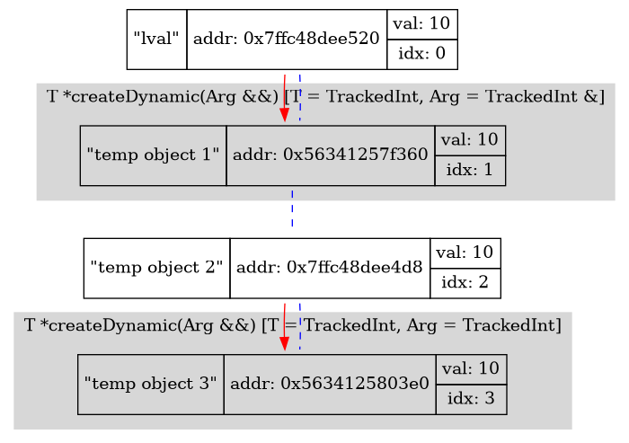
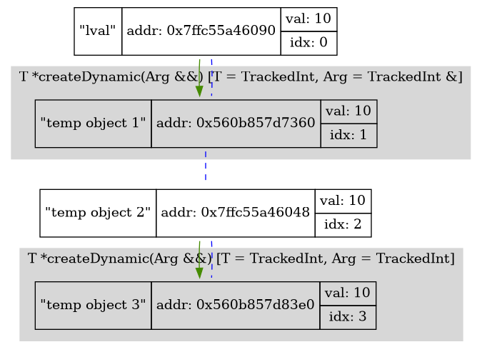

# Move semantics - advanced

In this article, I'm going to look at the less trivial aspects of move semantics. As an introduction, I recommend reading (this)[https://habr.com/ru/post/322132] article. In this article, I describe in detail only those moments which I had difficulties with.

## std::move

In the previous article, we managed to optimize unnecessary copying of temporary objects. But there are situations when we, as programmers, see that same can be done with with non-temporary objects:

```c++
TrackedInt square(TrackedInt arg)
{
    FUNC_ENTRY;
    return arg * arg;
}

void testEntry()
{
    INT(a, 10);
    INT(result, square(a));
    // a is not used anymore
}
```

Of course, compiler can't move `a` automatically - we must tell the compiler that test is not used and it's content can be "stolen" instead of copying. Due to C++ semantics, it can be done with:

```c++
INT(a, 10);
INT(result, static_cast<TrackedInt&&>(square(a)));
// a is can't be used anymore
```

C++ standart library offers us `std::move` - special function that casts anything to rvalue reference. It's implementation looks something like this:

```c++
template<typename T>
typename std::remove_reference<T>::type &&move(T &&arg)
{
    return static_cast<typename std::remove_reference<T>::type&&>(arg);
}
```

Here comes a special entity of the C++ called *universal reference*. It occurs when writing `T&&` for an **deducted** type in a template, so universal references can be lvalue or rvalue references depending on some conditions. This behavior is due to the following points:
- When `T&&` used as template function argument, the type `T` is deducted to `A` or `A&`, depending on which object is passed to the function - rvalue or lvalue correspondingly.
- Applying the first point, double references can occur in templates. *Reference collapsing* rule deals with it - in case of double reference, `&` is always wins. For example, `&& &` goes to `&`, and only `&& &&` goes to `&&`.

In case of `move`, `T&& arg` is the universal reference - `T` unfolds to `T` if rvalue is passed or `T&` if lvalue is passed. So, due to reference collapsing, initial expression goes to `T&& arg` and `T& arg` correspondingly. `std::remove_reference` helps to get the raw type of `T` in any unfold case to create an rvalue reference type and cast argument to them.

So, all this magic is to simplify the code and allow to pass both lvalue and rvalue. With `move`, previous example can be written like this:

```c++
INT(a, 10);
INT(result, square(std::move(a)));
// a is can't be used anymore
```

Let's make sure the move works:

| Without move                    | With move                    |
| ------------------------------  | ---------------------------- |
|  |  |

Just like we want - object is moved instead of copying.

## std::forward

Sometimes we want to pass the value to inner function - and so that rvalue is moved and lvalue is copied. This situation occurs, for example, in some wrappers like `make_unique`, where you need to pass arguments to the wrapper to construct an object inside. There are the sample program which contains `createDynamic` function which creates the class instance with some given argument.

In order to pass both lvalues and rvalues, we use an universal reference. There are three attempts to implement argument forwarding:

```c++
template<typename T, typename Arg>
T *createDynamic(Arg &&arg)
{
    // case 1
    return new T(arg);
    // case 2
    return new T(std::move(arg));
    // case 3
    return new T(std::forward<Arg>(arg));
}

void testEntry()
{
    INT(lvalue, 10);

    TrackedInt *lvalue_copy = createDynamic<TrackedInt>(lvalue);
    TrackedInt *rvalue_copy = createDynamic<TrackedInt>(TrackedInt(10));
}
```

| Without anything                | Move                                    | Forward                         |
| ------------------------------  | --------------------------------------- | ------------------------------- |
|  |  |  |

Thanks to the tool, we can in practice make sure that:

- Case 1 doesn't work as intented. Rvalue is not perfectly forwarded - it's copied inside `createDynamic`. This is because `arg` is lvalue - despite it's type.

- Maybe use `move` (case 2)? It's a bad idea - lvalue which passed to `createDynamic` will be unexpectedly moved in this case.

- Remember that we have `Arg` template parameter - it unfolds to `T` if rvalue is passed and to `T&` if lvalue is passed. So, we want to get a function, which would get an argument of type `A` and return different type depending on what type does `Arg` unfolds to - `A&&` in the first case and `A&` in the second. It is what `std::forward` does in case 3 - note that `Arg` is used as template parameter. In case 3, the test program works as intented - rvalue is moved and lvalue is copied.

`std::forward` implementation looks something like this:

```c++
template<typename T>
T&& forward(T &arg)
{
    return static_cast<T&&>(arg);
}
```

There is just reference collapsing and nothing more. `T& arg` is unfolded to `A& arg` in any case. When `T` is `A`, `T&&` goes to `A&&`, and when `T` is `A&`, `T&&` goes to `A&`. So, we get the expected behavior.

## Conclusion

- We figured out how we can tell the compiler that we no longer need an object and it can be moved instead of copying.
- We also dealt with the problem of a perfect forwarding.

Over the course of two articles, we figured out what semantic ideas in modern C ++ allow us to get rid of the problem of unnecessary copies. Thus, we are getting closer to the "zero cost C++".
